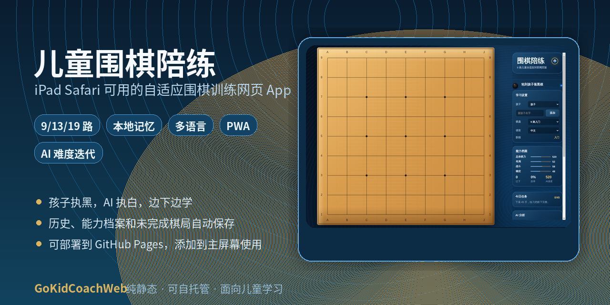
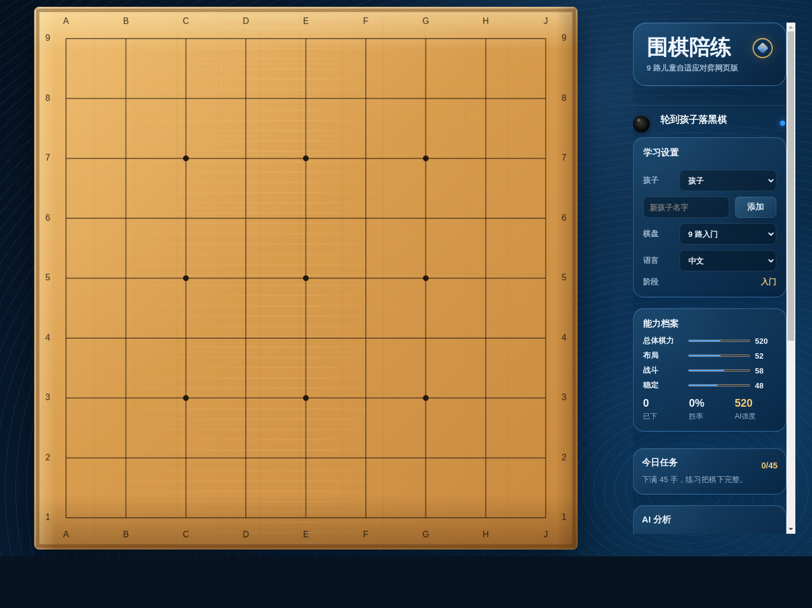

# GoKidCoachWeb | 儿童围棋陪练

一个为 iPad Safari 设计的儿童围棋自适应陪练网页 App。无需安装 App、无需后端服务器，部署到 GitHub Pages 后即可打开使用，并可添加到 iPad 主屏幕。



## 亮点

- **iPad 友好**：横屏棋盘优先，适合孩子直接触摸落子。
- **纯静态部署**：只需要 GitHub Pages、Netlify、Vercel 或任意静态网页托管。
- **本地记忆**：历史记录、能力档案、家长设置和未完成棋局会保存在浏览器里。
- **19 路离线陪练**：固定 19 路棋盘，适合完整棋盘练习。
- **自适应 AI**：每局结束后根据胜负、手数、吃子和完整度调整下一局难度。
- **学习任务**：自动生成今日任务，例如下满手数、发现打吃、保护弱棋和占角。
- **多语言界面**：支持中文、粤语、英文、日文和韩文。
- **家长视角**：查看最近趋势、胜率、平均手数，并可导出/导入备份。
- **可扩展 AI**：可填写远程 AI 或 KataGo HTTPS 接口，失败时自动回退本地 AI。

## 适合谁

- 刚开始学围棋的孩子。
- 想在 iPad 上随时练 19 路完整棋盘的家庭。
- 想要一个轻量、可离线基础打开、可自己部署的围棋练习网页。
- 想把远程 KataGo 或自己的 AI 接口接入前端的开发者。

## 界面预览



## 快速体验

本项目是纯前端网页，`index.html` 必须通过网页服务打开。直接把文件拷到 iPad 后用 Safari 打开本地 `index.html`，通常不能正常使用 PWA、缓存和脚本权限。

在电脑本地试用：

```bash
python3 -m http.server 8080
```

然后在同一 Wi-Fi 下，用 iPad Safari 打开：

```text
http://电脑局域网IP:8080
```

打开后点击 Safari 分享按钮，选择“添加到主屏幕”。

## 部署到 GitHub Pages

推荐上传到 GitHub Pages，这样 iPad 不需要依赖电脑开服务器。

1. 在 GitHub 新建公开仓库，例如 `gokidcoach-web`。
2. 上传本目录全部文件，确保 `index.html` 在仓库根目录。
3. 进入仓库 `Settings` -> `Pages`。
4. `Build and deployment` 选择 `Deploy from a branch`。
5. Branch 选择 `main`，Folder 选择 `/root`，保存。
6. 等待几分钟后，用 iPad Safari 打开 GitHub Pages 生成的网址。
7. 在 Safari 里点“分享” -> “添加到主屏幕”。

发布后的地址通常是：

```text
https://你的GitHub用户名.github.io/仓库名/
```

## 功能

- 固定 19 路棋盘，不再提供棋盘尺寸切换。
- 孩子执黑，AI 执白。
- 支持落子、提子、禁自杀、停一手、悔棋。
- 支持全局同形禁着，避免简单劫争立即回提。
- 双方连续停一手后弹出终局确认。
- 终局估算采用棋子 + 空点归属 + 贴目。
- 支持 SGF 棋谱导出。
- 支持多个孩子档案，每个孩子有独立能力、历史和当前棋局。
- 当前未完成棋局会自动保存，下次打开继续保留棋盘、手数、提子和悔棋状态。
- PWA 已包含图标、manifest 和 Service Worker，添加到主屏幕后支持基础离线打开。

## 记忆和难度机制

记忆功能使用浏览器 `localStorage`。同一台 iPad、同一个 Safari 站点地址下，关闭网页或从主屏幕重新打开，记录会继续保留。

AI 难度会在每局结束后自动调整。系统会根据胜负、孩子吃子情况、开局落点、中后盘完成度生成表现分，再上调或下调下一局 AI 强度和学习阶段。

数据只保存在当前设备浏览器里。换设备、换浏览器、清除 Safari 网站数据，记录会消失。家长面板支持导出/导入 JSON 备份。

## 远程 AI / KataGo

家长查看里可以填写远程 AI 地址或 KataGo 分析地址。GitHub Pages 是 HTTPS 页面，因此远程接口也必须使用 HTTPS，并在服务端允许 CORS。

前端会发送当前棋盘、棋谱、贴目、执棋方和学习阶段。接口可返回：

```json
{ "x": 3, "y": 3 }
```

或：

```json
{ "move": { "x": 3, "y": 3 } }
```

或：

```json
{ "move": "D4" }
```

如果远程接口失败，页面会自动回退到本地增强启发式 AI，并在家长面板显示状态。本地 AI 会优先考虑救弱棋、打吃、连接、分断、开局大场和避免早期一二线随手棋；同时保留 `window.GoKidCoachPolicyModel.scoreMove(...)` 轻量策略模型接口，后续可接入 19 路离线策略权重。

## 其他部署方式

也可以使用 Netlify Drop：

1. 打开 https://app.netlify.com/drop
2. 把整个项目文件夹拖进去。
3. Netlify 会生成一个网址。
4. 在 iPad Safari 打开这个网址。
5. 点“分享” -> “添加到主屏幕”。

## 项目结构

```text
.
├── 404.html
├── .gitignore
├── index.html
├── styles.css
├── app.js
├── manifest.webmanifest
├── sw.js
├── LICENSE
├── assets/
└── screenshots/
```

## 当前限制

- 规则裁判已支持基础禁自杀和全局同形禁着，但不是完整职业规则引擎。
- 胜负评估是教学向简化估算，不是正式数子或数目。
- 内置 AI 是本地增强启发式陪练，并预留轻量策略模型接口；仍不等同于 KataGo。
- 本地记忆依赖浏览器存储，清除网站数据会删除记录。

## License

MIT License

## GitHub 仓库简介建议

```text
儿童围棋自适应陪练网页 App，支持 iPad Safari、PWA、本地记忆、多语言和 AI 难度调整。
```
